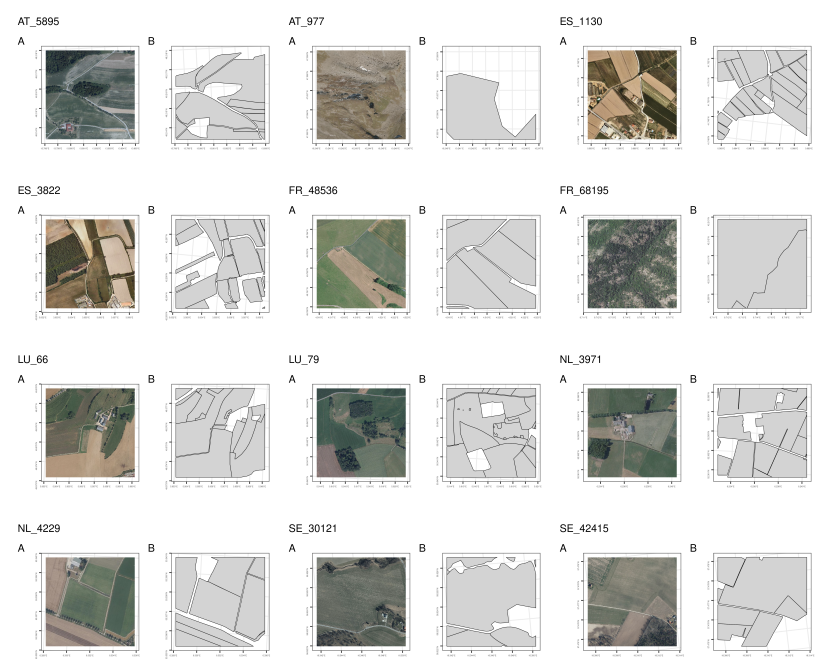

# AI4Boundaries

AI4boundaries is a Python package that facilitates download of the AI4boundaries data set. 

Check out [the paper](https://essd.copernicus.org/preprints/essd-2022-298/)

d'Andrimont, R., Claverie, M., Kempeneers, P., Muraro, D., Yordanov, M., Peressutti, D., Batič, M., and Waldner, F.: AI4Boundaries: an open AI-ready dataset to map field boundaries with Sentinel-2 and aerial photography, Earth Syst. Sci. Data Discuss. [preprint], https://doi.org/10.5194/essd-2022-298, in review, 2022.



## Installation and updating
Use the package manager [pip](https://pip.pypa.io/en/stable/) to install `ai4boundaries` like below. 
Rerun this command to check for and install  updates.
```bash
pip install git+https://github.com/waldnerf/ai4boundaries
```

#### Demo of some of the features:
```python
from ai4boundaries import download_ai4boundaries

dir = '/path/to/ai4boundaries_data'
download_ai4boundaries(dir)


```

## Abstract

Field boundaries are at the core of many agricultural applications and are a key enabler for operational monitoring of agricultural production to support food security. Recent scientific progress in deep learning methods has highlighted the capacity to extract field boundaries from satellite and aerial images with a clear improvement from object-based image analysis (e.g., multiresolution segmentation) or conventional filters (e.g., Sobel filters). However, these methods need labels to be trained on. So far, no standard data set exists to easily and robustly benchmark models and progress the state of the art. The absence of such benchmark data further impedes proper comparison against existing methods. Besides, there is no consensus on which evaluation metrics should be reported (both at the pixel and field levels). As a result, it is currently impossible to compare and benchmark new and existing methods. To fill these gaps, we introduce AI4Boundaries, a data set of images and labels readily usable to train and compare models on the task of field boundary detection. AI4Boundaries includes two specific data sets: (i) a 10-m Sentinel-2 monthly composites for large-scale analyses in retrospect, (ii) a 1-m orthophoto data set for regional-scale analyses such as the automatic extraction of Geospatial Aid Application (GSAA). All labels have been sourced from GSAA data that have been made openly available (Austria, Catalonia, France, Luxembourg, the Netherlands, Slovenia, and Sweden) for 2019 representing 14.8 M parcels covering 376 km2. Data were selected following a stratified random sampling drawn based on two landscape fragmentation metrics, the perimeter/area ratio and the area covered by parcels, thus taking into account the diversity of the agricultural landscapes. The resulting “AI4Boundaries” dataset consists of 7,831 samples of 256 by 256 pixels for the 10-m Sentinel-2 dataset and of 512 by 512 pixels for the 1-m aerial orthophoto. Both datasets are provided with the corresponding vector ground-truth parcel delineation (2.5 M parcels covering 47,105 km2) and with a raster version already pre-processed and ready to use. Besides providing this open dataset to foster computer vision developments of parcel delineation methods, we discuss perspectives and limitations of the dataset for various types of applications in the agriculture domain and consider possible further improvements.

## CITATION

@Article{essd-2022-298,
AUTHOR = {d'Andrimont, R. and Claverie, M. and Kempeneers, P. and Muraro, D. and Yordanov, M. and Peressutti, D. and Bati\v{c}, M. and Waldner, F.},
TITLE = {AI4Boundaries: an open AI-ready dataset to map field boundaries with Sentinel-2 and aerial photography},
JOURNAL = {Earth System Science Data Discussions},
VOLUME = {2022},
YEAR = {2022},
PAGES = {1--16},
URL = {https://essd.copernicus.org/preprints/essd-2022-298/},
DOI = {10.5194/essd-2022-298}
}

## License
[MIT](https://choosealicense.com/licenses/mit/)
